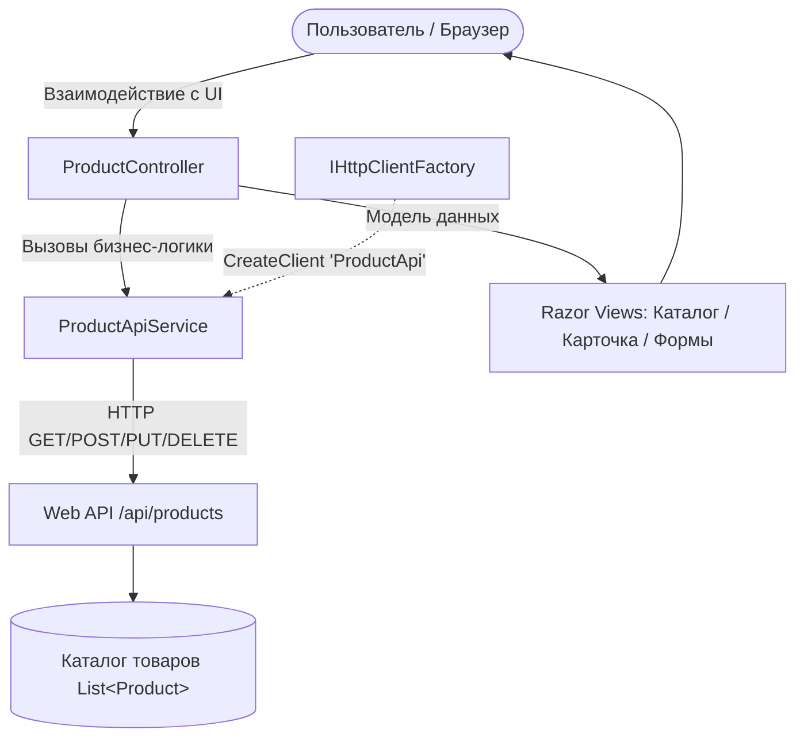

# Лабораторная работа 05 (СРСП): Клиентское приложение ASP.NET Core для работы с Web API (ProductClient)

## Цель работы
Научиться вызывать методы Web API из клиентского приложения ASP.NET Core с использованием `HttpClient` и `IHttpClientFactory`, отправлять HTTP-запросы различных типов (`GET`, `POST`, `PUT`, `DELETE`), преобразовывать JSON в модели C# и профессионально обрабатывать ответы сервера (`200 OK`, `201 Created`, `400 Bad Request`, `404 Not Found`, `500 Internal Server Error`).

---

## Архитектура приложения

### Схема взаимодействия
```text
Пользователь (Браузер)
         │
         ▼
ProductController (MVC)
         │
         ├──► IProductApiService (ProductApiService)
         │            │
         │            ▼
         │      IHttpClientFactory.CreateClient("ProductApi")
         │            │ (HTTP GET/POST/PUT/DELETE)
         │            ▼
         │      Web API (/api/products)
         │            │
         │            ▼
         │      Каталог товаров (List<Product>)
         │
         └──► Razor Views (Index, Details, Create, Edit)
```



---

## Структура проекта

```text
Web_service_development_modul_05-lab_05/
├── .gitignore                          # Исключение временных файлов (bin/, obj/, .vs/)
├── ProductClient.slnx                  # Файл решения .NET
├── README.md                           # Полный отчет по лабораторной работе
├── DESIGN_AND_ANSWERS.md               # Архитектурный разбор и ответы на вопросы
└── src/
    └── ProductClient/
        ├── Controllers/
        │   ├── ProductController.cs    # MVC Контроллер интерфейса пользователя
        │   └── Api/
        │       └── ProductsApiController.cs # REST API контроллер (/api/products)
        ├── Models/
        │   └── Product.cs              # Доменная модель товара
        ├── Services/
        │   ├── IProductApiService.cs   # Интерфейс клиента Web API
        │   └── ProductApiService.cs    # Реализация сервиса с IHttpClientFactory
        ├── Views/
        │   ├── Shared/_Layout.cshtml   # Главный макет с Bootstrap 5
        │   └── Product/
        │       ├── Index.cshtml        # Таблица каталога товаров
        │       ├── Details.cshtml      # Детальный просмотр товара
        │       ├── Create.cshtml       # Форма добавления товара
        │       └── Edit.cshtml         # Форма редактирования товара
        ├── Properties/
        │   └── launchSettings.json     # Профили запуска и порт 5000
        ├── appsettings.json            # Базовый адрес API (BaseAddress)
        ├── Program.cs                  # Настройка DI, HttpClientFactory и Swagger
        └── ProductClient.csproj        # Файл проекта ASP.NET Core
```

---

## Спецификация Endpoints

### Методы Web API (`/api/products`)
| HTTP Method | URL | Назначение | Коды ответов |
|---|---|---|---|
| `GET` | `/api/products` | Получить список всех товаров | `200 OK` |
| `GET` | `/api/products/{id}` | Получить товар по ID | `200 OK`, `404 Not Found` |
| `POST` | `/api/products` | Создать новый товар | `201 Created`, `400 Bad Request` |
| `PUT` | `/api/products/{id}` | Изменить существующий товар | `200 OK`, `400 Bad Request`, `404 Not Found` |
| `DELETE` | `/api/products/{id}` | Удалить товар по ID | `200 OK`, `404 Not Found` |
| `GET` | `/swagger` | Интерактивная документация Swagger UI | `200 OK` |

### Пользовательские маршруты интерфейса (MVC)
| Метод | URL | Описание |
|---|---|---|
| `GET` | `/` или `/Product` | Страница каталога товаров (таблица со статусами и ценами) |
| `GET` | `/Product/Details/{id}` | Карточка товара с подробными характеристиками |
| `GET` | `/Product/Create` | Форма добавления нового товара |
| `POST` | `/Product/Create` | Отправка POST-запроса на добавление товара в Web API |
| `GET` | `/Product/Edit/{id}` | Форма редактирования характеристик товара |
| `POST` | `/Product/Edit/{id}` | Отправка PUT-запроса на обновление товара в Web API |
| `POST` | `/Product/Delete/{id}` | Удаление товара через отправку DELETE-запроса к Web API |

---

## Модель данных `Product`

```csharp
public class Product
{
    public int Id { get; set; }
    public string Name { get; set; } = string.Empty;
    public string Description { get; set; } = string.Empty;
    public decimal Price { get; set; }
    public int Quantity { get; set; }
}
```

| Свойство | Тип | Описание |
|---|---|---|
| `Id` | `int` | Уникальный числовой идентификатор товара |
| `Name` | `string` | Наименование товара |
| `Description` | `string` | Описание характеристик товара |
| `Price` | `decimal` | Стоимость товара в тенге (₸) |
| `Quantity` | `int` | Количество единиц на складе |

---

## Примеры JSON данных

### 1. Получение каталога товаров (`GET /api/products`)
```json
[
  {
    "id": 1,
    "name": "Notebook",
    "description": "Ноутбук для работы и учебы",
    "price": 350000,
    "quantity": 5
  },
  {
    "id": 2,
    "name": "Mouse",
    "description": "Беспроводная мышь",
    "price": 8000,
    "quantity": 15
  },
  {
    "id": 3,
    "name": "Keyboard",
    "description": "Механическая клавиатура",
    "price": 15000,
    "quantity": 10
  }
]
```

### 2. Добавление товара (`POST /api/products`)
```json
{
  "name": "Monitor 27\"",
  "description": "IPS монитор 144Hz",
  "price": 180000,
  "quantity": 7
}
```

---

## Настройка и использование `IHttpClientFactory`

В `Program.cs` зарегистрирован именованный клиент `"ProductApi"`:
```csharp
builder.Services.AddHttpClient("ProductApi", client =>
{
    var baseAddress = builder.Configuration["ApiSettings:BaseAddress"] ?? "http://localhost:5000/";
    client.BaseAddress = new Uri(baseAddress);
    client.DefaultRequestHeaders.Add("Accept", "application/json");
});
```

В сервисе `ProductApiService`:
```csharp
public class ProductApiService : IProductApiService
{
    private readonly IHttpClientFactory _httpClientFactory;

    public ProductApiService(IHttpClientFactory httpClientFactory)
    {
        _httpClientFactory = httpClientFactory;
    }

    private HttpClient CreateClient() => _httpClientFactory.CreateClient("ProductApi");

    public async Task<List<Product>> GetAllAsync()
    {
        var client = CreateClient();
        var response = await client.GetAsync("api/products");
        if (response.IsSuccessStatusCode)
        {
            return await response.Content.ReadFromJsonAsync<List<Product>>() ?? new();
        }
        return new();
    }
}
```

---

## Запуск приложения

```bash
# 1. Собрать проект
dotnet build

# 2. Запустить приложение
dotnet run --project src/ProductClient/ProductClient.csproj
```

* **Веб-интерфейс каталога:** [http://localhost:5000/](http://localhost:5000/)
* **Swagger UI для Web API:** [http://localhost:5000/swagger](http://localhost:5000/swagger)

---

## Инструкция по отправке в GitHub

1. Создайте пустой репозиторий на GitHub (например, `Web_service_development_modul_05-lab_05`).
2. В терминале в папке `Web_service_development_modul_05-lab_05` выполните:
   ```bash
   git remote add origin https://github.com/<ВАШ_АККАУНТ>/<ИМЯ_РЕПОЗИТОРИЯ>.git
   git push -u origin main
   ```
